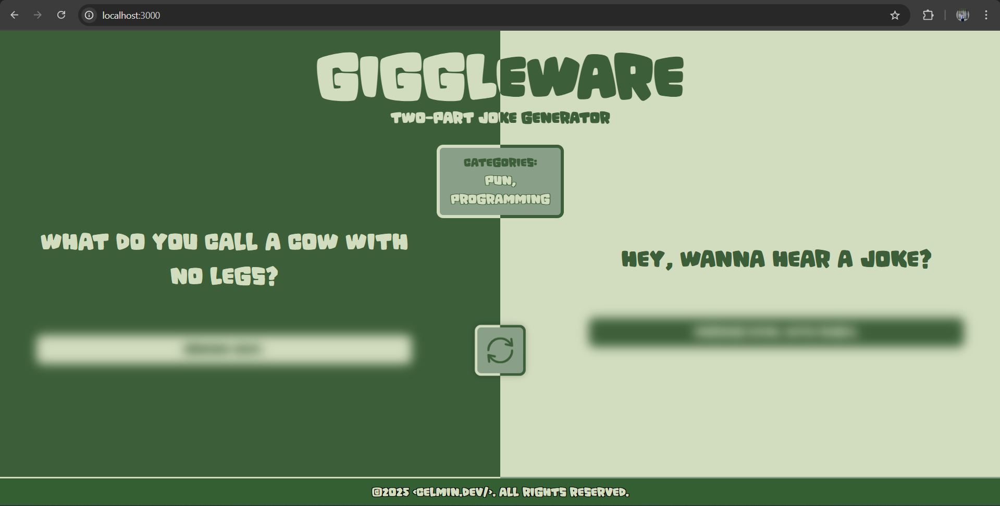

# ✨Giggleware: Two-Part Joke Generator

**Giggleware** is a fun web application built with `Express.js` and `Node.js` that fetches and displays two-part jokes from the **JokeAPI**. The app integrates the public API using `Axios` and dynamically renders jokes using EJS templates.

 ## 🛠️ Tech Stack
 - Node.js
 - Express.js
 - Axios
 - EJS (Embedded javaScript)

## 💡 Get Started
### 1️⃣ Clone the Repository
```bash
git clone https://github.com/yourusername/giggleware.git
cd giggleware
```
### 2️⃣ Install Dependencies
```bash
npm install
```
### 3️⃣ Run the Server
➤ Option 1: Run Normally
``` bash
node index.js
```
➤ Option 2: Use Nodemon for Auto-Restart on Changes
If you want the server to restart automatically when you make changes, install nodemon globally:
```bash
npm install -g nodemon
```
Then start the serve with:
```bash
nodemon index.js
```

"The application will be running at *http://localhost:3000*"

## 🔎 Overview


## 🤝 Contribution
Feel free to fork the repo and submit a pull request with improvements or additional features!

## 🪪 License
This project is open-source and available under the MIT License.

**💡 Let's build something awesome together! 🚀**
